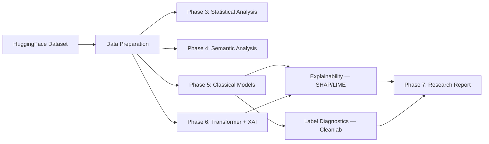

# EvasionBench — Earnings-Call Evasion Detection

[](https://github.com/dustinober1/EvasionBench/actions/workflows/ci.yml)

[](LICENSE)
[](https://github.com/psf/black)
[](https://github.com/astral-sh/ruff)

**Detect evasion patterns in earnings-call Q&A** using classical ML and Transformer models, with full explainability and label quality analysis.

---

## 3-Minute Reviewer Path

If you're reviewing this project for an ML Engineer role:

1. Run `make run-dashboard` and test a Q&A pair in the live classifier
2. Open the Results Explorer page to inspect model comparison + diagnostics
3. Read [Case Study](docs/case_study.md) for modeling decisions and error analysis
4. Read [Hiring Manager Brief](docs/hiring_manager_brief.md) for impact summary

## What is EvasionBench?

Corporate executives sometimes evade analyst questions during earnings calls — providing indirect, vague, or off-topic responses instead of direct answers. EvasionBench is an end-to-end NLP pipeline that classifies Q&A pairs from earnings-call transcripts into three categories:

- **direct** — the answer directly addresses the question
- **intermediate** — partial answer with some evasion
- **fully_evasive** — the answer completely evades the question

The project uses the [FutureMa/EvasionBench](https://huggingface.co/datasets/FutureMa/EvasionBench) dataset from HuggingFace and implements a 7-phase research pipeline spanning data preparation, statistical analysis, model training, explainability (SHAP/LIME), label diagnostics (Cleanlab), and automated report generation.

## Key Results

| Model | Accuracy | Macro F1 | Type |
|-------|----------|----------|------|
| **Logistic Regression** | **0.643** | **0.534** | TF-IDF + sklearn Pipeline |
| XGBoost (Boosting) | 0.609 | 0.450 | TF-IDF + SVD + XGBClassifier |
| Decision Tree | 0.587 | 0.436 | TF-IDF + DecisionTreeClassifier |

> Logistic Regression achieves the best performance, suggesting the evasion detection decision boundary is relatively linear in TF-IDF feature space. The intermediate class remains the hardest to classify across all models.

## Architecture



## Features

- **Multiple model families** — Logistic Regression, Decision Tree, XGBoost, and Transformer (BERT)
- **Explainability** — SHAP values, LIME explanations, and Captum integrated gradients
- **Label quality analysis** — Cleanlab-powered mislabel detection and near-duplicate identification
- **Interactive dashboard** — Streamlit app with live inference and results explorer
- **REST API** — FastAPI endpoint for real-time evasion detection
- **Reproducible pipeline** — DVC stages with experiment tracking via MLflow
- **26 test files** — Comprehensive unit, smoke, and integration tests

## Quick Start

```bash
# Clone and setup
git clone https://github.com/dustinober1/EvasionBench.git
cd EvasionBench
python -m venv .venv
source .venv/bin/activate
pip install -r requirements.txt

# Download data and run CI checks
python scripts/download_data.py
make ci-check

# Launch the dashboard
make run-dashboard

# Or start the API
make run-api
```

### Docker

```bash
docker compose up -d
# API at http://localhost:8080 | Dashboard at http://localhost:8501
```

## Project Structure

```
EvasionBench/
├── api/                    # FastAPI inference API
├── artifacts/              # DVC-tracked outputs
│   ├── analysis/          #   Phase 3–4 statistical & semantic analysis
│   ├── models/            #   Phase 5–6 trained model artifacts
│   ├── explainability/    #   SHAP/LIME explanation outputs
│   ├── diagnostics/       #   Label quality reports
│   └── reports/           #   Phase 7 research reports
├── dashboard/             # Streamlit app (main + Results Explorer)
├── data/                  # Raw and processed datasets
├── docker/                # Dockerfile (multi-stage build)
├── docs/                  # Architecture, research summary, guides
├── scripts/               # Executable workflow entrypoints
├── src/                   # Reusable Python modules
│   ├── analysis/          #   Statistical analysis sub-modules
│   ├── inference.py       #   Model loading & prediction
│   ├── models.py          #   Training pipelines
│   ├── evaluation.py      #   Metrics & artifact contracts
│   ├── explainability.py  #   SHAP/LIME/Captum wrappers
│   └── data.py            #   Dataset download & validation
└── tests/                 # 26 test files (unit/smoke/integration)
```

## Developer Commands

| Command | Description |
|---------|-------------|
| `make ci-check` | Full CI: structure verify → black → ruff → pytest with coverage |
| `make test` | Run test suite with coverage reporting |
| `make lint` | Check formatting with Black |
| `make format` | Auto-format code with Black |
| `make run-dashboard` | Launch Streamlit dashboard |
| `make run-api` | Launch FastAPI server |
| `make docker-up` | Start all services via Docker Compose |

## Documentation

- [Architecture & Design](docs/architecture.md) — Pipeline architecture, technology choices, design decisions
- [Research Summary](docs/research_summary.md) — Research question, methodology, findings, limitations
- [Case Study](docs/case_study.md) — Model selection rationale, failure modes, and lessons learned
- [Hiring Manager Brief](docs/hiring_manager_brief.md) — Interview-ready summary of impact and engineering scope
- [Script-First Workflow](docs/script_first_workflow.md) — Development workflow and migration policy
- [DVC Guide](docs/dvc_guide.md) — Pipeline reproduction and data versioning
- [Explainability Guide](docs/explainability_guide.md) — SHAP/LIME analysis walkthrough

## Dataset

This project uses the [FutureMa/EvasionBench](https://huggingface.co/datasets/FutureMa/EvasionBench) dataset on HuggingFace — a collection of earnings-call Q&A pairs annotated with evasion labels.

## License

MIT
