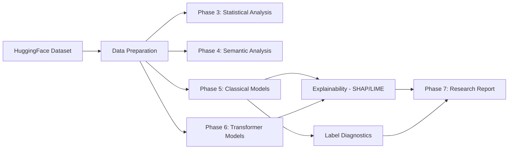

# EvasionBench Architecture

## Overview

EvasionBench is a multi-phase NLP research pipeline for detecting evasion patterns in earnings-call Q&A transcripts. The system processes raw HuggingFace data through analysis, modeling, explainability, and reporting phases.

## Pipeline Architecture



## Phase Breakdown

| Phase | Purpose | Key Artifacts |
|-------|---------|---------------|
| Data | Download & validate from HuggingFace | `data/raw/`, `data/processed/` |
| Phase 3 | Core stats, lexical, linguistic quality | `artifacts/analysis/phase3/` |
| Phase 4 | Semantic similarity, topic modeling | `artifacts/analysis/phase4/` |
| Phase 5 | Classical ML baselines (LogReg, Tree, XGBoost) | `artifacts/models/phase5/` |
| Phase 6 | Transformer baselines + XAI | `artifacts/models/phase6/`, `artifacts/explainability/` |
| Phase 7 | Automated research report generation | `artifacts/reports/phase7/` |

## Technology Stack

| Component | Technology | Rationale |
|-----------|-----------|-----------|
| Feature Engineering | TF-IDF with `[SEP]` token | Simple, interpretable, works well for text classification |
| Classical Models | scikit-learn, XGBoost | Strong baselines, fast training, interpretable |
| Deep Learning | HuggingFace Transformers | State-of-the-art NLP, transfer learning |
| Explainability | SHAP, LIME, Captum | Model-agnostic + model-specific explanations |
| Pipeline | DVC | Reproducible ML pipelines with data versioning |
| Experiment Tracking | MLflow | Metric logging, model registry |
| Label Quality | Cleanlab | Automated label error detection |
| API | FastAPI | Async, auto-docs, Pydantic validation |
| Dashboard | Streamlit | Rapid ML app prototyping |

## Design Decisions

### Script-First Architecture
All executable logic lives in `scripts/` with reusable modules in `src/`. Notebooks are legacy/reference only. This ensures reproducibility and testability.

### DVC Pipeline
Each phase is a DVC stage with explicit dependencies and outputs. Running `dvc repro` reproduces the entire pipeline from data download to report generation.

### Feature Combination Strategy
Question and answer text are combined with a `[SEP]` token (`question [SEP] answer`) before TF-IDF vectorization. This preserves the relationship between Q&A pairs while using a simple feature representation.

### Model Evaluation Contract
Every model must produce exactly 4 artifacts: `metrics.json`, `classification_report.json`, `confusion_matrix.json`, and `run_metadata.json`. This is enforced by `src/evaluation.py`.

## Directory Structure

```
EvasionBench/
├── api/                    # FastAPI inference API
├── artifacts/              # DVC-tracked outputs
│   ├── analysis/          # Phase 3-4 analysis results
│   ├── models/            # Phase 5-6 trained models
│   ├── explainability/    # SHAP/LIME outputs
│   ├── diagnostics/       # Label quality reports
│   └── reports/           # Phase 7 research reports
├── dashboard/             # Streamlit web application
├── data/                  # Raw and processed datasets
├── docker/                # Container configuration
├── docs/                  # Documentation and guides
├── scripts/               # Executable workflow entrypoints
├── src/                   # Reusable Python modules
│   └── analysis/          # Analysis sub-modules
└── tests/                 # Test suite
```
